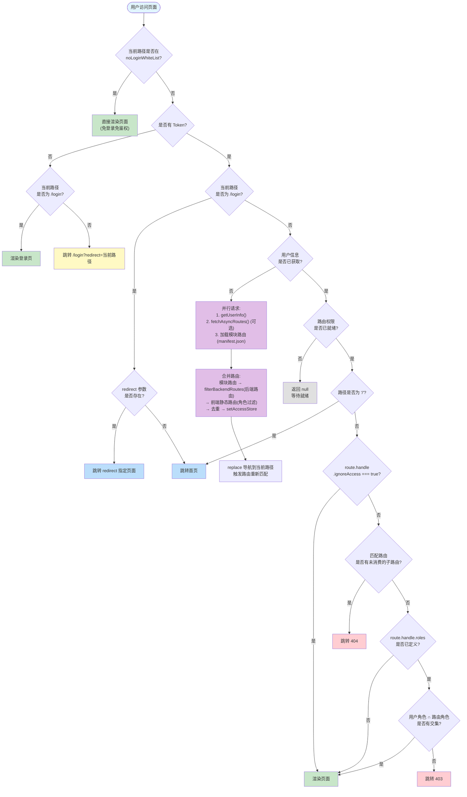
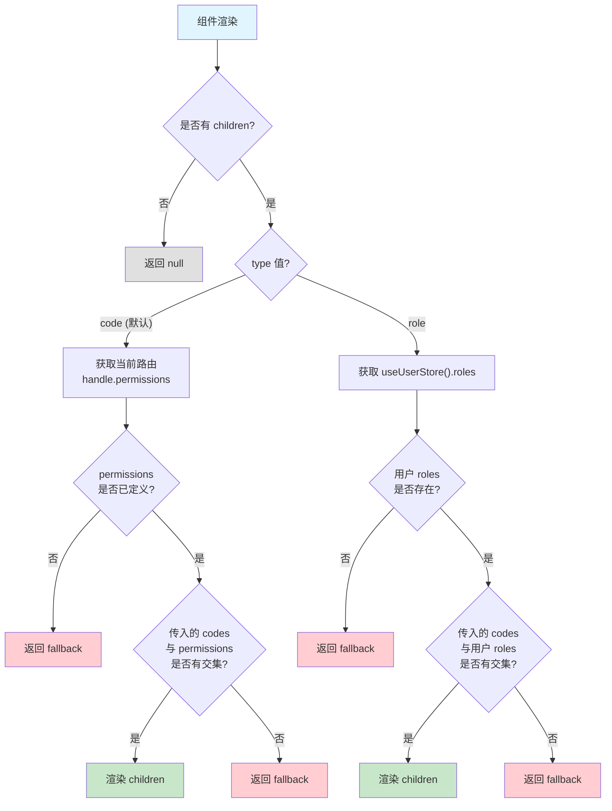

# 权限设计逻辑分析

## 1. 整体架构

本项目的权限系统分为三个层次，从粗到细依次为：

| 层次 | 控制粒度 | 核心模块 | 判断时机 |
|------|---------|---------|---------|
| 路由级 | 页面级访问控制 | `AuthGuard` | 每次路由导航 |
| 菜单级 | 侧边栏可见性 | `generateMenuItemsFromRoutes` | 路由注入后 |
| 按钮级 | 元素级显示/隐藏 | `<AccessControl>` | 组件渲染时 |

## 2. 角色与权限数据模型

### 2.1 角色体系

系统预定义角色常量（`src/hooks/use-access/constants.ts`）：

```ts
AccessControlRoles = { admin: "admin", common: "common" }
```

用户角色通过 `/user-info` 接口获取，存储于 `useUserStore().roles`（`string[]`）。

### 2.2 权限码体系

按钮级权限码采用统一前缀格式（同文件）：

```ts
accessControlCodes = {
  get:    "permission:button:get",
  update: "permission:button:update",
  delete: "permission:button:delete",
  add:    "permission:button:add",
}
```

权限码定义在路由元信息的 `handle.permissions` 数组中，由后端动态下发。

### 2.3 路由元信息（RouteMeta）

每条路由通过 `handle` 字段携带权限元数据（`src/router/types.ts`）：

| 字段 | 类型 | 含义 |
|------|------|------|
| `roles` | `string[]` | 允许访问的角色列表，未定义则不限制 |
| `permissions` | `string[]` | 页面内按钮级权限码 |
| `ignoreAccess` | `boolean` | 为 `true` 时跳过权限校验 |
| `hideInMenu` | `boolean` | 在侧边栏菜单中隐藏 |
| `backstage` | `boolean` | 标记来自后端 API 的路由 |

## 3. 路由分类与访问控制

系统将路由分为五大类，各类别具有不同的权限策略：

```
┌───────────────────────────────────────────────────────┐
│                     路由分类                           │
├───────────────┬───────────────────────────────────────┤
│ 核心路由       │ login、404 — 始终存在，login 受白名单管理 │
│ 外部路由       │ privacy-policy 等 — 免登录免鉴权        │
│ 模块路由       │ modules/* — 最高优先级，优先于后端路由    │
│ 后端动态路由   │ API 下发 — 受 enableBackendAccess 控制  │
│ 前端静态路由   │ routes/static/ — 受 enableFrontendAccess 控制 │
└───────────────┴───────────────────────────────────────┘
```

### 3.1 模式切换

通过偏好设置 `usePreferencesStore` 中的两个开关控制路由来源：

| 配置项 | 默认值 | 作用 |
|--------|-------|------|
| `enableBackendAccess` | `true` | 启用后端动态路由 |
| `enableFrontendAccess` | `false` | 启用前端静态路由角色过滤 |

两种模式可同时启用，路由合并后通过 `removeDuplicateRoutes` 去重。

### 3.2 后端路由获取方式

由 `src/router/routes/config.ts` 中的 `isSendRoutingRequest` 控制：

- **`true`（默认）**：单独调用 `fetchAsyncRoutes()`（`/get-async-routes`）获取路由数据
- **`false`**：从 `fetchUserInfo()`（`/user-info`）返回的 `menus` 字段中提取路由

### 3.3 模块路由优先级

模块路由（从 `manifest.json` 加载）的顶级 `path` 会覆盖同路径的后端路由：

```ts
// auth-guard.tsx 中的 filterBackendRoutes
const modulePaths = new Set(routes.map(r => r.path).filter(Boolean));
const filterBackendRoutes = (backendRoutes) =>
  backendRoutes.filter(r => !modulePaths.has(r.path));
```

## 4. 路由级权限校验流程（AuthGuard）

`AuthGuard` 是包裹整个应用的守卫组件，位于 `src/router/guard/auth-guard.tsx`。其判断逻辑的顺序**不可随意调整**：

1. **路由白名单判断** — 若当前路径属于 `noLoginWhiteList`（外部路由），直接放行
2. **未登录判断** — 未登录则跳转 `/login`（携带 `redirect` 参数以便登录后回跳）
3. **已登录 + 登录页** — 已登录用户访问 `/login` 则跳转首页或 `redirect` 指定页
4. **异步获取用户信息和路由** — 首次进入时并行请求用户信息和路由配置
5. **等待状态** — `isAuthorized` 和 `isAccessChecked` 未就绪时返回 `null`
6. **根路径重定向** — `/` 重定向到 `VITE_BASE_HOME_PATH`
7. **`ignoreAccess` 检查** — 路由标记了 `ignoreAccess: true` 则跳过角色校验
8. **父路由拦截** — 匹配到的是父路由（仍有子路由未消费），跳转 404
9. **角色校验** — 路由定义了 `roles` 时，用户必须拥有至少一个匹配角色，否则跳转 403

## 5. 菜单级权限控制

路由注入完成后，`setAccessStore` 调用 `generateMenuItemsFromRoutes` 生成菜单：

- 标记了 `hideInMenu: true` 的路由不出现在侧边栏
- `index` 路由（叶子路由）不单独显示
- 前端模式下，`generateRoutesByFrontend` 已根据角色过滤了无权路由，生成的菜单自然不包含不可访问项
- 后端模式下，后端仅返回用户有权访问的路由，菜单由后端数据驱动

## 6. 按钮级权限控制

通过 `<AccessControl>` 组件和 `useAccess()` Hook 实现：

### 6.1 使用方式

```tsx
// 按权限码控制（默认）
<AccessControl codes="permission:button:add">
  <Button>新增</Button>
</AccessControl>

// 按角色控制
<AccessControl type="role" codes="admin">
  <Button>仅管理员可见</Button>
</AccessControl>

// 无权限时显示 fallback
<AccessControl codes="permission:button:delete" fallback={<span>无权限</span>}>
  <Button danger>删除</Button>
</AccessControl>
```

### 6.2 判断逻辑

- **`type="code"`（默认）**：从当前匹配路由的 `handle.permissions` 中查找传入的权限码
- **`type="role"`**：从 `useUserStore().roles` 中查找传入的角色值
- 匹配时不区分大小写
- 开发模式下对不合法的权限码或角色打印 `console.warn`

## 7. 认证流程

### 7.1 登录

1. 调用 `fetchLogin()` → 后端返回 `{ token, refreshToken }`
2. Token 存储于 `useAuthStore`（Zustand persist，key 经过 `getAppNamespace` 前缀）
3. 页面刷新后 `AuthGuard` 检测到 token 存在，触发用户信息和路由的获取

### 7.2 Token 刷新

HTTP 客户端（`ky`）在收到 401 时自动尝试用 `refreshToken` 刷新，成功后重放原请求。

### 7.3 登出

调用 `fetchLogout()` 后，依次重置 `auth` → `user` → `access` → `tabs` 四个 store。

## 8. 系统判断逻辑流程图



## 9. 按钮级权限判断流程图



## 10. 关键文件索引

| 文件路径 | 职责 |
|---------|------|
| `src/router/guard/auth-guard.tsx` | 路由守卫，权限校验主逻辑 |
| `src/store/auth.ts` | Token 存储、登录/登出 |
| `src/store/user.ts` | 用户信息、角色 |
| `src/store/access.ts` | 路由权限状态、动态路由注入 |
| `src/store/preferences/index.ts` | enableBackendAccess / enableFrontendAccess 开关 |
| `src/router/routes/config.ts` | isSendRoutingRequest 配置 |
| `src/router/utils/generate-routes-from-backend.ts` | 后端路由转前端路由 |
| `src/router/utils/generate-routes-from-frontend.ts` | 前端路由角色过滤 |
| `src/hooks/use-access/index.ts` | 按钮级权限判断 Hook |
| `src/hooks/use-access/constants.ts` | 权限码和角色常量 |
| `src/components/access-control/index.ts` | 按钮级权限控制组件 |
| `src/router/types.ts` | RouteMeta 类型定义 |
| `fake/async-routes.fake.ts` | 后端路由 Mock 数据 |
| `fake/user.fake.ts` | 用户角色 Mock 数据 |
