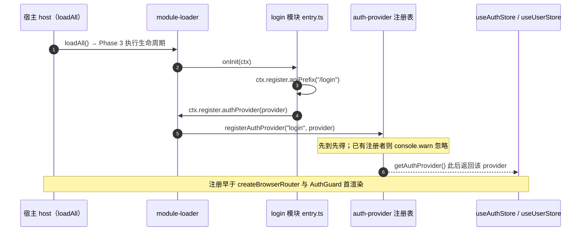
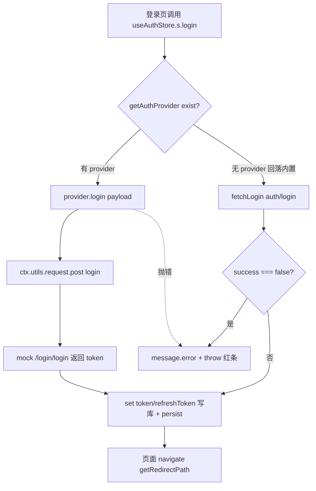
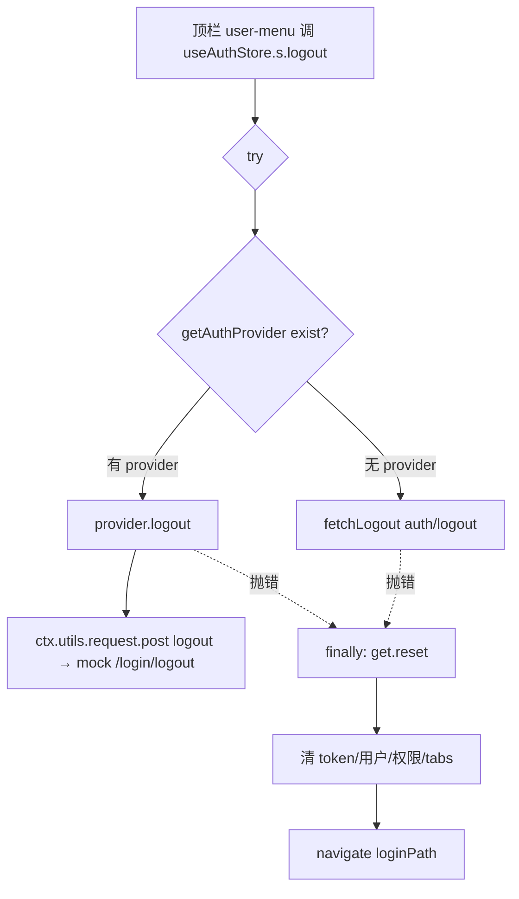
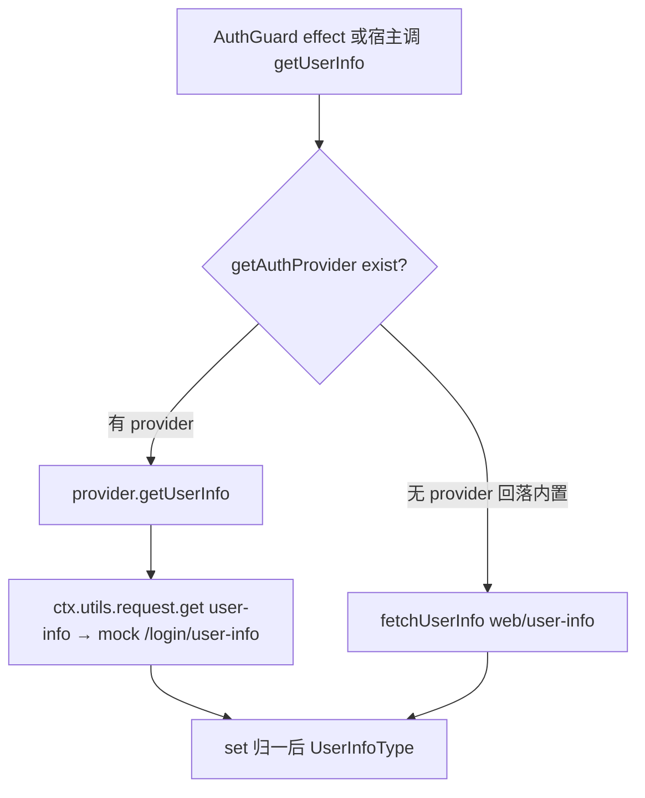
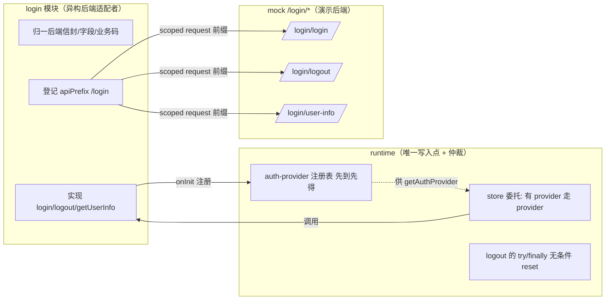
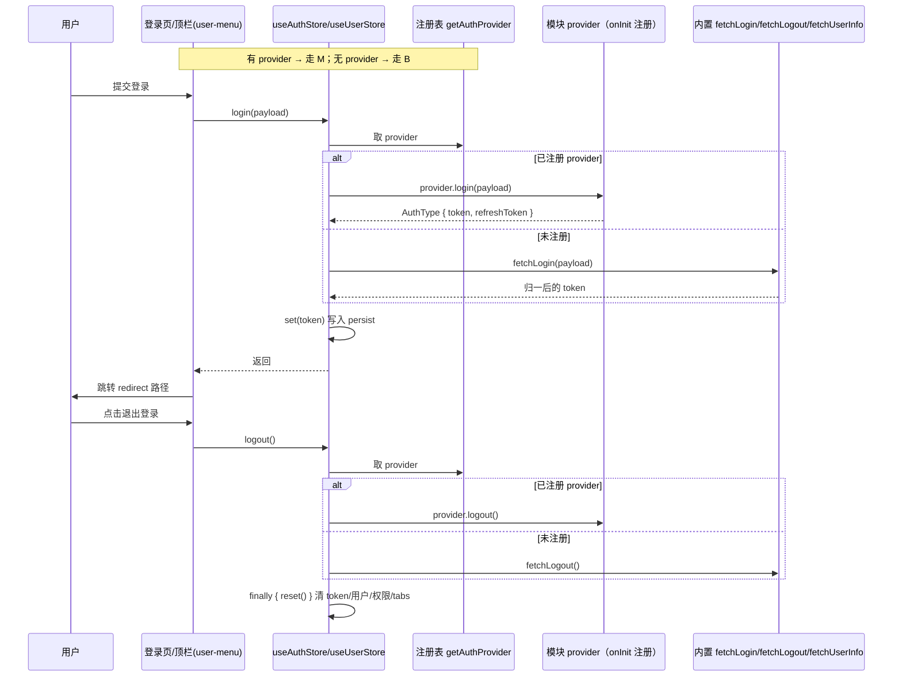
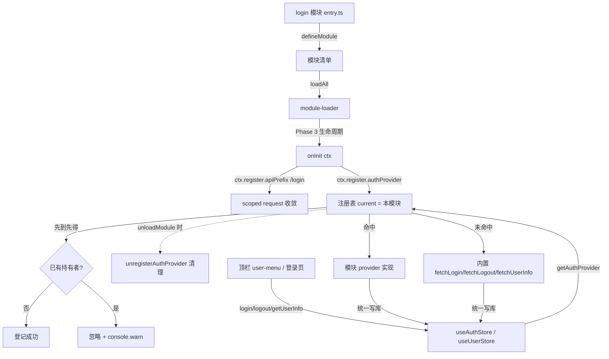

# 认证 Provider 注入设计（Auth as Injection）

> 目标：runtime 把「登录 / 登出 / 取用户信息」从**内置后端契约**降级为**默认实现**，
> 允许模块经生命周期钩子注入自己的实现，从而对接异构认证后端。
>
> 前置阅读：`202609021142-login-module-design.md`（P0–P4 登录模块化，本文是其 P5）、
> `module-development-guide.md`（模块手册）。
>
> 动机：`useAuthStore.login/logout`（`packages/runtime/src/store/auth.ts:31-55`）把
> `fetchLogin`/`fetchLogout` 写死，模块无任何替换缝。playground 是纯前端形态
> （无 `api/config.yaml`，`/api/*` 由 `mock/*.mock.mjs` 提供），而 `mock/` 只有
> home/notification 三条路由 —— 实测四个认证接口全部 404：
>
> ```
> POST /api/auth/login           → 404 No mock for POST /api/auth/login
> POST /api/auth/logout          → 404 No mock for POST /api/auth/logout
> GET  /api/web/user-info        → 404 No mock for GET /api/web/user-info
> GET  /api/web/get-async-routes → 404 No mock for GET /api/web/get-async-routes
> ```
>
> 登录表现为弹一条 404 红条、token 不写入；退出登录**完全无反应**——
> `logout()` 里 `await fetchLogout()` 先抛错，后面的 `reset()` 与 user-menu 的
> `navigate(loginPath)` 一行都不执行。

## 1. 设计决策

| 决策点 | 结论 |
| --- | --- |
| 注入入口 | **模块生命周期钩子** `ctx.register.authProvider()`（`onInit`），不是 React hook |
| 为何不用 React hook | 认证是**模块级**能力不是页面级能力。登出发生在顶栏（`user-menu.tsx:26`），用户在 `/home` 刷新后可能从未挂载过登录页；生命周期注册发生在 `loadAll` Phase 3，早于 `createBrowserRouter`（`host.tsx:150`）与 AuthGuard 首次渲染，任何入口都拿得到 |
| 冲突仲裁 | **先到先得 + `console.warn` 忽略**，与 `resolve-login-route.ts:53` 的 login 去重同一规则（确定性、可测） |
| `login` 返回契约 | `Promise<AuthType>`（即 `{ token, refreshToken }`），**由 runtime 写库**；store 保持唯一写入点 |
| 登出失败语义 | `finally { reset() }` —— 本地清理**不因后端失败而阻塞** |
| 接管粒度 | **全量接管**：`login`/`logout`/`getUserInfo` 三者都必填，不支持部分接管（半托管状态下两条链路并存，行为不可推理） |
| 异构适配位置 | 下沉到 provider 内部：后端信封、字段命名、业务码由模块自己归一，runtime 只认 `AuthType`/`UserInfoType` |
| 出口 | 只导出 `AuthProvider` **类型**；注册函数不导出（注册只能经 `ctx`，防止绕过生命周期） |

## 2. 契约

新增 `packages/runtime/src/store/auth-provider.ts`：

```ts
export interface AuthProvider {
	login: (payload: LoginInfo) => Promise<AuthType>
	logout: () => Promise<void>
	getUserInfo: () => Promise<UserInfoType>
}
```

注册表（模块作用域，普通模块级变量，**不用 zustand**）：

```ts
let current: { moduleName: string, provider: AuthProvider } | undefined;

export function registerAuthProvider(moduleName: string, provider: AuthProvider): void
export function getAuthProvider(): AuthProvider | undefined
export function unregisterAuthProvider(moduleName: string): void
```

不用 zustand 的理由：`slots.ts` 用 store 是因为布局组件要订阅变化；provider 只在
store action 与守卫 effect 中被读（非渲染期），无订阅需求。

`registerAuthProvider` 在已有注册者时 `console.warn` 并**直接返回**（先到先得）。

## 3. runtime 侧改动

### 3.1 `store/auth.ts`

```ts
login: async (payload) => {
	const provider = getAuthProvider();
	if (provider) {
		set(await provider.login(payload));
		return;
	}
	const response = await fetchLogin(payload);
	if (response.success === false) {          // 内置链路原样保留（F12）
		message.error(response.message || "登录失败");
		throw new Error(response.message || "登录失败");
	}
	set({ ...response.result });
},

logout: async () => {
	try {
		const provider = getAuthProvider();
		if (provider)
			await provider.logout();
		else
			await fetchLogout({ refreshToken: get().refreshToken });
	}
	finally {
		get().reset();                          // 无条件清本地
	}
},
```

runtime **不校验** provider 返回的 token 是否为空串：业务成败由 provider 用抛错表达，
内置链路的 `success === false` 检查是内置实现自己的事。

### 3.2 `store/user.ts`

```ts
getUserInfo: async () => {
	const provider = getAuthProvider();
	const result = provider
		? await provider.getUserInfo()
		: (await fetchUserInfo()).result;
	set({ ...result });
	return result;
},
```

`auth-guard.tsx:88` 的调用点**不改**——委托下沉到 store，守卫零感知。
（`getUserInfo()` 全仓仅此一个调用点，但放在 store 里可覆盖未来调用方。）

### 3.3 `module-loader`

- `types.ts:15-20`：`register` 增加 `authProvider: (provider: AuthProvider) => void`
- `module-loader/index.ts:39-46`：`authProvider: provider => registerAuthProvider(definition.name, provider)`
  —— 与 `registerSlot` 同构，闭包 `definition.name`，模块拿不到别人的名字
- `module-loader/index.ts:294-304`：`unloadModule` 中 `unregisterAuthProvider(name)`，与 `removeModuleSlots(name)` 并列

### 3.4 出口 `index.ts`

```ts
export type { AuthProvider } from "./store/auth-provider";
```

`tests/runtime-exports.test.ts` 是冻结契约，新增导出须同步白名单。

依赖方向：`auth-provider.ts` 只 import `api/user/types` 的类型，不 import 任何 store
→ `store/auth.ts`、`store/user.ts` 引用它无环。

## 4. 数据流

**登录**：登录页 `useAuthStore(s => s.login)`（模块代码不变）→ 有 provider 走 provider，
`set()` 写 token → 抛错原样冒泡给页面 catch（红条，现状不变）。

**登出**：顶栏 → `try { provider?.logout() ?? fetchLogout() } finally { reset() }`
→ 清 token / 用户 / 权限 / tabs。

**用户信息**：AuthGuard effect → `useUserStore.getUserInfo()` → 有 provider 走 provider。

**未注册 provider** 时行为与今日**完全一致**（含内置 404 与 F12 信封检查）。

## 5. login 模块侧落地（playground）

`apps/playground/modules/src/login/entry.ts` 增加生命周期，走**模块自带接口**：

```ts
lifecycle: {
	onInit: async (ctx) => {
		ctx.register.apiPrefix("/login");
		ctx.register.authProvider({
			async login(payload) {
				const res = await ctx.utils.request.post("login/login", { json: payload })
					.json<ApiResponse<AuthType>>();
				if (res.success === false)
					throw new Error(res.message || "登录失败");
				return res.result;
			},
			async logout() {
				await ctx.utils.request.post("login/logout").json();
			},
			async getUserInfo() {
				const res = await ctx.utils.request.get("login/user-info")
					.json<ApiResponse<UserInfoType>>();
				return res.result;
			},
		});
	},
},
```

配套 `apps/playground/mock/auth.mock.mjs`（模块自有命名空间，与框架 `auth/*` 无交集）：

| url | method | 响应 |
| --- | --- | --- |
| `/login/login` | post | 口令非空 → `{ code: 200, result: { token, refreshToken }, success: true }`；否则 `success: false` + 中文 message |
| `/login/logout` | post | `{ code: 200, result: {}, success: true }` |
| `/login/user-info` | get | `{ code: 200, result: { id, username: "Admin", roles: ["admin"], ... }, success: true }` |

**已知边界（本次不解决）**：

1. `ctx.utils.request` 是 scoped client，底层仍是全局 `request`，会为 `/api/login/login`
   注入空的 `Authorization: Bearer `（`isAnonymousApi` 只认 `auth/login`）。无害但语义不干净，
   正解是 §推迟项 的匿名前缀通道。
2. playground 走 shell 宿主链，**没有 AuthGuard**（`host.tsx:160-165`），故 `getUserInfo`
   不会自动触发、`host.tsx:50-58` 播种的演示用户仍在。可验证的是：登录后 token 真实写入
   persist、登出后 token 与播种用户被 `reset()` 一并清空。

### 5.1 流程图（登录 / 登出 / 取用户信息 + runtime↔login 交互）

> 下列 mermaid 图与 §3 / §4 / §5 的实现一一对应，可对照阅读。

**图 1 · 注册时序（模块经 `onInit` 把 provider 交给 runtime）**



**图 2 · 登录流程**



**图 3 · 登出流程（本地清理不被后端失败阻塞）**



**图 4 · 取用户信息流程（AuthGuard / 宿主触发）**



**图 5 · runtime 与 login 模块职责边界**



## 6. 测试

新增 `tests/runtime/auth-provider.test.ts`：

1. 注册后 `login()` 走 provider，token 写入 store
2. provider 抛错 → `login()` 拒绝、已持久化 token 不变
3. 未注册 → 走内置 `fetchLogin`（mock），`success:false` 仍拒绝（回归 F12）
4. 重复注册 → 第二个被忽略 + warn
5. `unloadModule` → provider 注销，退回内置实现
6. 登出时 provider 抛错 → 本地仍被 `reset()`
7. **时序用例**：不挂载登录页、仅 `loadAll` 后直接调 `logout()` → 走 provider（坐实选生命周期而非 React hook 的价值）
8. `getUserInfo` 有/无 provider 两条路径

## 7. 落地顺序

每步可独立合并、可回滚：

1. `store/auth-provider.ts`（新）+ `index.ts` 导类型 + 冻结导出测试同步
2. `store/auth.ts` 委托 + `logout` 的 `try/finally`
3. `store/user.ts` 委托
4. `module-loader`：ctx 口子 + `unloadModule` 清理
5. 测试 `tests/runtime/auth-provider.test.ts`
6. playground login 模块 `onInit` + `mock/auth.mock.mjs`
7. 模块开发手册增补「认证 Provider 注入」章节

## 8. SOLID 对照

| 原则 | 落点 |
| --- | --- |
| SRP | provider 只负责「换 token / 取用户」；store 仍是唯一写入点；注册表只做仲裁 |
| OCP | 新增认证后端 = 新增 provider，runtime 零修改（DIP 的经典形态） |
| LSP | provider 与内置 `fetchLogin/fetchLogout/fetchUserInfo` 对 store 而言可互换 |
| ISP | 注册面只有 `ctx.register.authProvider` 一个方法，模块不感知注册表 |
| DIP | store 依赖 `AuthProvider` 抽象，不依赖任何具体后端；模块依赖 `ctx`，不 import `#src/` |

## 9. 推迟项

| 推迟项 | 触发条件 | 增量形态 |
| --- | --- | --- |
| `getUserInfo` 拆成独立 `userProvider` | 出现「只换用户接口、沿用宿主登录」的诉求 | 从 `AuthProvider` 拆出可选方法或独立注册口 |
| 匿名前缀通道（前作 §5 已记） | 模块自有登录接口需要免 token 头、401 不 refresh | `ctx.register.anonymousApiPrefix()` |
| provider 热替换 | 出现运行时切换认证源的场景 | 注册表补版本号与显式覆盖 API |

## 10. 流程与交互图（mermaid）

### 10.1 登录 / 登出时序（runtime 视角）

含「已注册 provider → 走模块实现；未注册 → 回落内置」的分支。



### 10.2 runtime 与 login 模块的交互（生命周期 + 注册表）

重点表达「模块在 `onInit` 注册、runtime store 委托、先到先得、unload 清理」。


